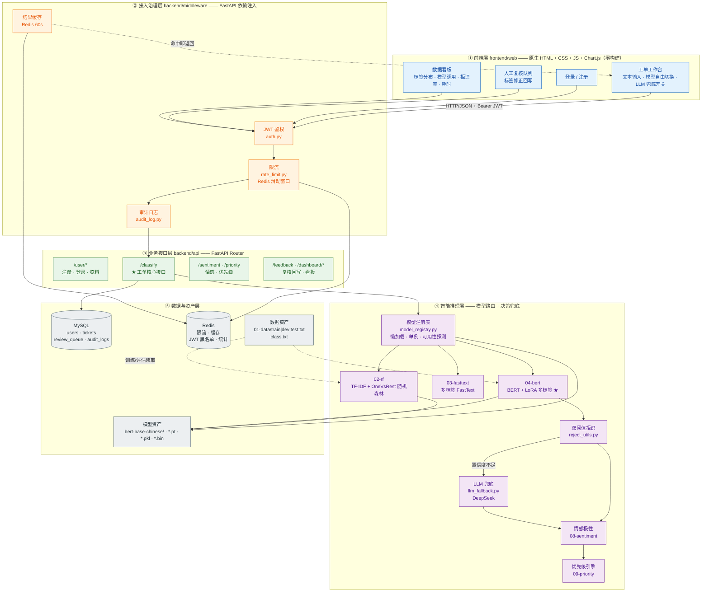
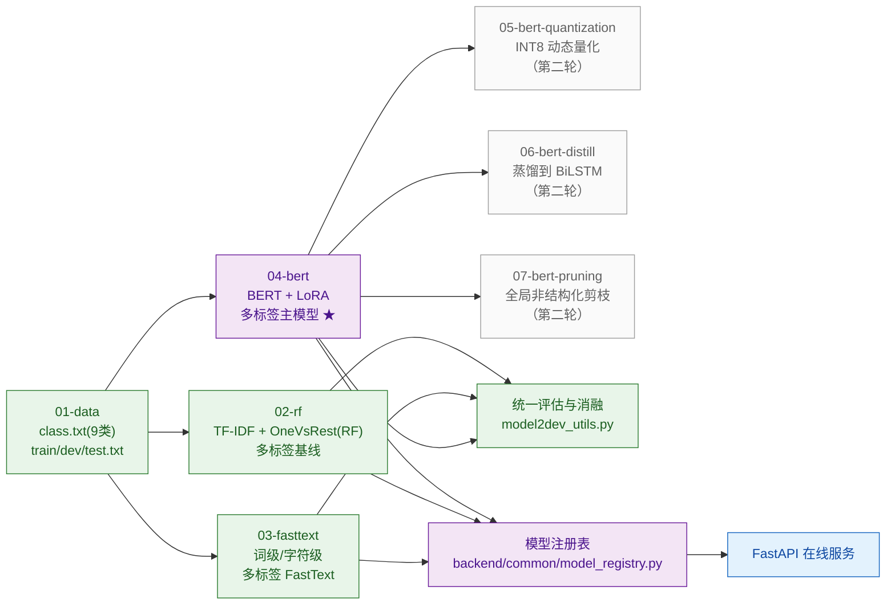
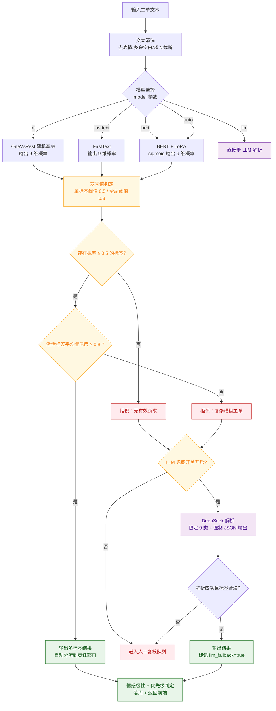
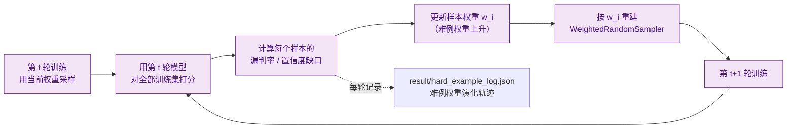

# ShopCare —— 电商客服工单智能处理平台 · 设计文档

> 版本：v1.0（核心闭环设计）
> 对应代码工程：`D:\project_File\ShopCare-main`
> 参考架构：`MindCare-main`（模块编号、分层方式、前后端组织、文档风格）
> 参考业务方案：《客服工单用户反馈文本分类——落地级NLP项目详细方案》
> 原始教学项目：`05_代码/szai8_tmf_project`（10 类新闻单标签分类）

---

## 一、项目定位

把「新闻标题 10 类**单标签**分类」这套教学链路，改造成**电商客服工单 9 类多标签自动分流平台**。

一句话区别：

| 维度 | 原项目（szai8_tmf_project） | ShopCare（本项目） |
|------|------------------------------|--------------------|
| 业务 | 新闻标题分类（课程练习） | 电商客服工单自动分流（真实业务） |
| 任务 | 单标签分类（softmax 互斥） | **多标签分类**（BCE，一条工单可命中多个诉求） |
| 模型 | RF / FastText / BERT 单标签 | RF / FastText / BERT **多标签** 三套对照 + LLM 兜底 |
| 微调 | 全量微调 | **LoRA 低秩适配**（冻结主干，显存↓，可增量加类） |
| 难点处理 | 无 | **难例动态加权采样** + **双阈值置信度拒识** |
| 交付形态 | 各模块独立脚本 + Flask 单页 | **FastAPI 服务 + 前端工作台 + 复核队列 + 看板** |
| 落地风险 | 无兜底，模型错了就错了 | LLM 兜底 + 人工复核队列，可商用 |

**为什么必须做多标签**：真实工单几乎都是混合诉求，单标签模型只能"二选一"，会把
"东西坏了要退款，客服还不理我"这种工单强行压成一个标签，导致派单错误。
多标签是本项目相对原教学项目的**第一性差异**，也是所有下游设计（难例采样、拒识、优先级）的前提。

---

## 二、业务背景与痛点

电商/APP/线上服务每天产生海量用户反馈与售后工单，传统人工分拣有三个硬伤：

1. **人力成本高、积压严重**：高峰期工单排队，用户反馈响应延迟，直接拉低店铺评分；
2. **分类标准不统一**：不同客服主观判断不同，同类问题分到不同部门，复盘统计数据失真；
3. **模糊工单无法处理**：口语化、错别字、诉求混杂的工单人工也容易误判，纯固定模型强行分类必然产生线上错误。

本项目要交付的是一套「**轻量化、高精度、可容错、可部署**」的工单自动分类与分流系统：
自动分流到物流/售后/财务/运营/技术等部门，沉淀问题数据辅助产品迭代，
并在模型没把握时用**拒识 → LLM 兜底 → 人工复核**三级机制保证线上不误判。

---

## 三、标签体系设计（9 类多标签）

设计原则：① 每个标签必须能路由到一个真实部门，否则分类没有业务价值；
② 标签之间边界清晰，允许组合但避免大面积语义重叠；
③ **不设"其他/未知"类**——模糊工单交给拒识 + LLM 兜底 + 人工复核，这正好是创新点 2 的落点。

| 索引 | 标签 | 中文名 | 覆盖子诉求 | 责任部门 | 基础优先级 |
|:----:|------|--------|------------|----------|:----------:|
| 0 | `logistics` | 物流配送 | 未发货、揽收慢、运输停滞、派送延迟、丢件、地址修改、快递员未送上门 | 物流仓储部 | P2 |
| 1 | `quality` | 商品质量 | 破损、瑕疵、功能故障、材质做工不符、过期变质、少件漏发 | 品控/供应商 | P1 |
| 2 | `after_sale` | 退款退货 | 退款、退货、换货、退款未到账、维修换新、售后维权 | 售后部 | P1 |
| 3 | `invoice` | 发票问题 | 开票申请、电子发票、发票信息错误、重开、发票未收到 | 财务部 | P2 |
| 4 | `price_promo` | 价格与优惠 | 价保补差、优惠券失效、活动规则、多扣款、赠品未发 | 运营部 | P2 |
| 5 | `payment_account` | 支付与账号 | 支付失败、重复扣款、订单异常、账号封禁或登录异常 | 技术/风控 | P1 |
| 6 | `consult` | 售前与使用咨询 | 使用方法、参数规格、适配性、库存与时效咨询、安装教程 | 客服中心 | P2 |
| 7 | `service` | 服务态度 | 回复慢、态度差、敷衍、承诺未兑现、推诿扯皮 | 客服质检 | P1 |
| 8 | `invalid` | 无效与恶意 | 灌水、广告、辱骂、与商品无关、恶意差评威胁、刷单 | 风控/直接归档 | — |

**与方案文档 6 类的映射关系**（保证可追溯，不是另起炉灶）：

| 方案文档原 6 类 | 本项目对应标签 | 说明 |
|-----------------|----------------|------|
| 物流问题 | `logistics` | 一一对应 |
| 商品质量问题 | `quality` | 一一对应 |
| 退款售后问题 | `after_sale` | 一一对应 |
| 产品功能咨询 | `consult` | 扩展为"售前 + 使用咨询" |
| 服务态度投诉 | `service` | 一一对应 |
| 无效/恶意反馈 | `invalid` | 一一对应 |
| —（新增） | `invoice` / `price_promo` / `payment_account` | 补齐售前售中链路，分别路由到财务/运营/技术 |

**多标签存在的证据**（也是消融实验「单标签 vs 多标签」的素材）：

```
快递走了十天还没到，找客服也没人理              -> logistics + service
锅收到就是坏的，我要退款，发票也没给我开         -> quality + after_sale + invoice
账号登不上，里面还有券没用，客服电话也打不通     -> payment_account + service
```

**标签组合统计目标**：平均标签数 1.6 ~ 2.2，单标签占比 45% 左右，双标签 40%，三标签 15%。

**边界约定**（标注一致性靠它保证）：

- 「说好次日达结果一周没到」→ `logistics`（履约问题），不算 `service`；
- 「客服承诺补发但没发」→ `service`（承诺未兑现），不算 `logistics`；
- 「刚买就降价要补差价」→ `price_promo`；「退货退款本身」→ `after_sale`；
- 「账号被盗刷下单」→ `payment_account` + `quality`? **否**，只判 `payment_account`（未见商品问题）；
- 纯谩骂无任何诉求 → `invalid`；谩骂 + 明确诉求 → 保留诉求标签，**不判** `invalid`。
---

## 四、系统总体架构

### 4.1 分层架构图



### 4.2 分层职责说明

| 层 | 目录 | 职责 | 不该做的事 |
|----|------|------|------------|
| ① 前端层 | `frontend/web` | 交互、结果可视化、模型选择、复核操作 | 不做任何业务判断与阈值逻辑 |
| ② 接入治理层 | `backend/middleware` | 鉴权、限流、审计、缓存 | 不碰模型推理细节 |
| ③ 业务接口层 | `backend/api` | 参数校验、编排、落库、组装响应 | 不直接读写模型权重 |
| ④ 智能推理层 | `02-rf` `03-fasttext` `04-bert` `08-sentiment` `09-priority` | 模型加载、预测、拒识决策、优先级 | 不感知 HTTP 与数据库 |
| ⑤ 数据与资产层 | `backend/database` `01-data` | 持久化、缓存、训练数据、模型文件 | 不做业务编排 |

**关键设计约束**：`04-bert` 的推理能力只暴露一个函数 `predict_fun(text, ...)`，
`backend` 只通过 `model_registry` 调用它——保证模型层可以被单独训练、评估、替换，
不会和 Web 框架耦合（这也是 MindCare 里 `predict_fun` 被 backend 复用的做法）。

### 4.3 部署形态（本阶段）

```
单机部署（开发/演示）
┌──────────────────────────────────────────────┐
│  uvicorn backend.app:app --host 0.0.0.0 --port 8000   ← FastAPI + 静态前端
│      ├── MySQL 127.0.0.1:3306   (业务数据)
│      └── Redis 127.0.0.1:6379   (限流/缓存/黑名单)
└──────────────────────────────────────────────┘
浏览器访问 http://127.0.0.1:8000/app
```

- 数据库连接信息全部走**环境变量**（`MYSQL_HOST` / `MYSQL_PORT` / `MYSQL_USER` / `MYSQL_PASSWORD` / `MYSQL_DB`），
  代码中不出现任何明文密码，仓库内只保留 `.env.example`；
- Redis 连接走 `REDIS_URL`；**Redis 不可用时自动降级为进程内存实现**（功能不中断，只是多实例下不共享）；
- MySQL 不可用时不静默降级（避免掩盖配置问题），直接抛出带修复提示的错误；
  但保留 `DB_BACKEND=memory` 开关，用于无需数据库的单元自检（`tools/verify_all_phases.py`）。

---

## 五、离线训练流水线



**阶段说明**：

- `01-data` 是所有训练脚本的唯一数据来源，格式统一为 `文本\t标签1,标签2`；
- `02-rf` / `03-fasttext` / `04-bert` 三套模型**共用同一套数据与同一套评估函数**，
  保证对照实验可比（这是 MindCare「05/06/07 复用 04-bert 代码」思路的延伸：这里进一步统一了评估口径）；
- `05/06/07` 是本轮**只留目录与接口**的模型优化阶段，实现前必须先把主模型指标跑出来；
- 训练产物统一落到 `04-bert/save_models/`、`02-rf/save_models/`、`03-fasttext/save_models/`，
  由 `model_registry` 探测是否存在，缺失的模型在页面上显示为"未训练"而不会让服务崩溃。

---

## 六、核心推理决策流程（创新点 2 的落地）



**为什么是"双阈值"而不是单阈值**：单阈值只能控制"这个标签算不算激活"，
无法表达"标签激活了，但整体判断是否足够可信"。真实场景中经常出现
"三个标签置信度都在 0.5~0.6 之间"的糊状输出——此时标签是合理的，但整体不可信，
必须拒识。全局阈值就是为这种"看起来有结果、实际不可靠"的工单准备的。

**三级兜底的成本递增**：本地模型（毫秒级、零成本）→ LLM 兜底（秒级、按 token 计费）
→ 人工复核（分钟级、人力成本最高）。设计目标是让 **85% 以上的工单在本地闭环**，
只有真正模糊的才升级，这样 LLM 成本可控、人力也不会被打爆。
---

## 七、核心模型设计（04-bert）

### 7.1 为什么用 LoRA

| 方案 | 显存占用 | 小样本表现 | 增量加类 | 教学解释成本 |
|------|----------|------------|----------|--------------|
| 全量微调 BERT | 高（需存全部梯度+优化器状态） | 易过拟合 | 需重训全量 | 低 |
| **LoRA 低秩适配** | **低（主干冻结，只训低秩矩阵）** | **不易过拟合** | **只换适配器即可** | 中（需讲清低秩分解） |
| 冻结主干 + 只训分类头 | 最低 | 欠拟合 | 快 | 低 |

工单场景的现实约束是：**标注数据少、类别可能增补、要能落到普通 CPU 机器演示**，
所以选 LoRA —— 它同时满足"效果接近全量微调"和"低成本可迭代"。

### 7.2 LoRA 实现要点（`04-bert/lora_utils.py`，手写不依赖 peft）

- 原理：对原始权重 `W` 不做修改，旁路加一个低秩增量 `ΔW = B·A`（`A: r×d_in`，`B: d_out×r`），
  前向变成 `h = Wx + (α/r)·B·A·x`；
- 初始化：`A` 用高斯随机，`B` **全零** —— 保证训练开始时旁路输出为 0，模型行为与预训练权重完全一致（这是 LoRA 能稳定收敛的关键细节）；
- 注入位置：注意力层的 `query` 与 `value`（用 `target_modules=['query','value']` 配置，可扩展）；
- 冻结策略：遍历 `named_parameters()`，只把名字里含 `lora_a` / `lora_b` 的参数设为 `requires_grad=True`，
  其余全部冻结（`mark_only_lora_trainable`）；
- 可训练参数占比打印：注入后打印 `可训练参数量 / 总参数量`，正常应在 **1% 以内**，用来验证冻结是否生效；
- 保存策略：只保存 LoRA 适配器 + 分类头（几十 KB ~ 几 MB），主干权重复用 `bert-base-chinese/`，
  **这也正好满足"不重复下载/分发预训练模型"的诉求**。

### 7.3 多标签输出头与损失

```
[BERT 主干（冻结）] → pooler_output (768) → Dropout(0.3) → Linear(768 → 9) → logits (9)
损失：BCEWithLogitsLoss(logits, multi_hot_label, pos_weight=每类正样本权重)
```

- 用 `BCEWithLogitsLoss` 而非 `CrossEntropyLoss`：9 个标签各自独立做二分类，互不排斥；
- `pos_weight` = `负样本数 / 正样本数`（按 dev/train 统计），用来缓解 `invoice`、`payment_account` 等长尾标签的欠拟合；
- 推理时对 9 个 logit 分别做 `sigmoid` 得到独立概率，**不做 softmax**（softmax 会强行让 9 个概率和为 1，与多标签语义冲突，这是新手最常踩的坑）。

### 7.4 创新点 1：多标签难例动态加权采样（`hard_example_sampler.py`）

**要解决的问题**：均匀采样下，模型会把大量算力花在"一句话只讲物流"的简单样本上，
而真正影响业务指标的是**多诉求混杂、标签漏判**的难例。

**难例定义**（三个信号加权，全部来自上一轮模型自己的预测）：

| 信号 | 含义 | 权重 |
|------|------|:----:|
| 标签数 | 标签越多，越可能是混合诉求难例 | `α = 0.5` |
| 漏判率 | 真实标签中概率 < 阈值的比例（模型没学到的） | `β = 1.0` |
| 置信度缺口 | `1 - 激活标签平均置信度`（模型犹豫的） | `γ = 0.8` |

样本权重公式：

```
w_i = 1 + α·(len(y_i) - 1)/2 + β·漏判率_i + γ·(1 - 平均置信度_i)
```

**动态迭代流程**：



工程细节：

- 每轮只在**训练集**上重新打分，`dev/test` 绝不参与权重计算（避免信息泄露）；
- 权重做归一化并设上限 `w_max = 5.0`，防止个别样本被反复采样导致过拟合；
- 每轮的权重分布（均值/最大/前 10% 难例索引）写入 `04-bert/result/hard_example_log.json`，
  这是消融实验"难例采样是否有效"的直接证据；
- 可用 `--use_hard_sampling false` 关闭，用于消融对比。

### 7.5 训练策略与超参数

| 配置项 | 取值 | 说明 |
|--------|------|------|
| 预训练模型 | `bert-base-chinese`（本地目录，不联网下载） | 换成 `hfl/chinese-roberta-wwm-ext` 只需改配置项 + 放模型目录 |
| LoRA `r` / `alpha` / `dropout` | 8 / 16 / 0.1 | 小数据场景的稳妥取值 |
| LoRA 目标模块 | `query`, `value` | 效果/参数量平衡点 |
| 学习率 | 2e-4（只作用于 LoRA + 分类头） | LoRA 专用学习率，比全量微调高一个量级 |
| Batch size | 32 | 显存不足时降到 16 |
| 最大长度 | 96 | 工单普遍短文本，96 足够且训练更快 |
| 训练轮次 | 5（早停 patience=2） | 监控 dev micro-F1，连续 2 轮不升则停 |
| 损失 | `BCEWithLogitsLoss` + `pos_weight` | 多标签 + 类别不均衡 |
| 优化器 | AdamW（weight_decay=0.01） | 标准选择 |
| 拒识阈值 | 单标签 0.5 / 全局 0.8 | 在 dev 集上网格搜索标定，写入 `config.py` |

---

## 八、目录结构与模块清单

```
ShopCare-main/
├── 01-data/                    # 数据层：原始数据、类别定义、停用词、EDA
│   ├── class.txt               #   9 类标签（顺序即索引）
│   ├── sentiment_class.txt     #   情感极性 3 类
│   ├── stopwords.txt           #   中文停用词
│   ├── train.txt / dev.txt / test.txt
│   ├── data_format.md          #   数据格式规范（含真实数据替换指南）
│   └── data_eda.py             #   标签分布 / 共现矩阵 / 长度分布
├── 02-rf/                      # 对照组 1：TF-IDF + OneVsRest 随机森林
├── 03-fasttext/                # 对照组 2：多标签 FastText（词级 / 字符级）
├── 04-bert/                    # ★ 核心：BERT + LoRA 多标签 + 难例采样 + 拒识 + LLM 兜底
│   ├── config.py               #   集中配置：路径 / LoRA / 阈值 / 训练超参
│   ├── lora_utils.py           #   手写 LoRA：注入 / 冻结 / 保存 / 加载
│   ├── dataloader_utils.py     #   数据集与加权采样器
│   ├── multilabel_model.py     #   模型：主干 + Dropout + 多标签头
│   ├── hard_example_sampler.py #   ★ 创新点 1：难例动态加权采样
│   ├── reject_utils.py         #   ★ 创新点 2：双阈值置信度拒识
│   ├── llm_fallback.py         #   LLM 兜底（DeepSeek，可开关）
│   ├── model2dev_utils.py      #   统一评估：学术指标 + 业务指标
│   ├── train_bert.py           #   训练主脚本（含早停、日志、最优权重保存）
│   ├── bert_predict_fun.py     #   对外唯一推理入口 predict_fun()
│   └── save_models/ · result/  #   权重、训练日志、难例权重演化轨迹
├── 05-bert-quantization/       # 模型优化（第二轮）：INT8 动态量化
├── 06-bert-distill/            # 模型优化（第二轮）：蒸馏 BiLSTM 学生模型
├── 07-bert-pruning/            # 模型优化（第二轮）：全局非结构化剪枝
├── 08-sentiment/               # 情感极性：词典 + 规则（支撑优先级，不依赖训练）
├── 09-priority/                # 优先级 & 人工复核规则引擎
├── 10-reply-recommend/         # 话术推荐（第二轮）
├── 11-ticket-kg/               # 工单根因知识图谱（第二轮）
├── backend/                    # FastAPI 后端
│   ├── app.py                  #   应用入口：路由挂载、中间件、静态托管、启动
│   ├── api/                    #   接口层：user_api / classify_api / dashboard_api
│   ├── common/                 #   shop_utils（标签元数据·部门映射）+ model_registry（模型懒加载）
│   ├── database/               #   db.py（PyMySQL 连接池）+ schema.sql（建表语句）
│   ├── middleware/             #   auth（JWT）/ rate_limit（Redis）/ audit_log（审计）
│   └── logs/                   #   审计与错误日志
├── frontend/web/               # 前端：index.html + css/style.css + js/app.js
├── tools/                      # generate_ticket_data（语料生成）/ check_dataset（数据体检）/ verify_all_phases（一键自检）
└── docs/                       # 改造方案 / 环境安装指南 / 标签规范
```

**模块清单（含输入输出与依赖，作为开发任务的验收依据）**：

| # | 模块 / 文件 | 职责 | 输入 → 输出 | 依赖 |
|---|-------------|------|-------------|------|
| 1 | `01-data/data_eda.py` | 数据体检与分布统计 | `train/dev/test.txt` → 控制台报表 | 仅标准库 + pandas（可选） |
| 2 | `tools/generate_ticket_data.py` | 生成小规模多标签工单语料 | 无 → `train/dev/test.txt` | 仅标准库 |
| 3 | `tools/check_dataset.py` | 格式校验 + 单标签升维多标签 | 原始文件 → 校验报告 / 新数据文件 | 仅标准库 |
| 4 | `02-rf/train_rf.py` | 基线训练与评估 | `train.txt` → `rf.pkl` + `tfidf.pkl` + 指标 | sklearn, jieba |
| 5 | `02-rf/rf_predict_fun.py` | 基线推理（统一签名） | 文本 → 9 维概率字典 | sklearn, jieba |
| 6 | `03-fasttext/train_fasttext.py` | 多标签 FastText 训练 | `train.txt` → `*.bin` + 指标 | fasttext |
| 7 | `03-fasttext/ft_predict_fun.py` | 基线推理（统一签名） | 文本 → 9 维概率字典 | fasttext |
| 8 | `04-bert/lora_utils.py` | LoRA 注入与冻结 | 模型 → 注入后的模型 + 参数量报告 | torch |
| 9 | `04-bert/hard_example_sampler.py` | 难例权重计算与采样器构建 | logits + 真值 → 样本权重 / Sampler | torch, numpy |
| 10 | `04-bert/reject_utils.py` | 双阈值拒识 | 概率 → 标签列表 + 是否拒识 + 拒识原因 | 无（纯函数） |
| 11 | `04-bert/llm_fallback.py` | LLM 兜底解析 | 文本 → 标签列表（失败返回 None） | openai SDK（可缺省） |
| 12 | `04-bert/model2dev_utils.py` | 统一评估 | 模型 + dataloader → 学术指标 + 业务指标 | torch, sklearn |
| 13 | `04-bert/train_bert.py` | 训练主流程 | `train/dev.txt` → 最优权重 + 训练日志 | torch, transformers |
| 14 | `04-bert/bert_predict_fun.py` | ★ 对外唯一推理入口 | 文本 + 参数 → 完整业务结果 | 上面若干模块 |
| 15 | `08-sentiment/sentiment_classifier.py` | 情感极性（词典+规则） | 文本 → `{polarity, score, 命中词}` | 仅标准库 |
| 16 | `09-priority/priority_engine.py` | 优先级与复核判定 | 标签 + 情感 → `{priority, need_review, 理由, SLA}` | 仅标准库 |
| 17 | `backend/common/shop_utils.py` | 标签元数据（中英/部门/权重） | — → 查询函数 | 仅标准库 |
| 18 | `backend/common/model_registry.py` | 模型懒加载与可用性探测 | 模型名 → 推理函数 / 不可用原因 | 各模型模块（软依赖） |
| 19 | `backend/api/classify_api.py` | 核心业务接口 | HTTP 请求 → 多标签 + 情感 + 优先级 + 话术 | model_registry, db |
| 20 | `backend/api/dashboard_api.py` | 看板统计 | 查询参数 → 聚合统计 | db |
| 21 | `backend/api/user_api.py` | 注册 / 登录 / 资料 | 请求 → JWT / 用户信息 | db, middleware.auth |
| 22 | `backend/database/db.py` | 数据访问层 | SQL 操作 → dict 结果 | PyMySQL |
| 23 | `backend/middleware/*.py` | 鉴权 / 限流 / 审计 | 请求 → 放行或拒绝 + 日志 | PyJWT, redis（可降级） |
| 24 | `frontend/web/*` | 工作台 / 复核队列 / 看板 | 用户操作 → 接口调用与渲染 | 原生 JS + Chart.js |

---

## 九、接口设计（FastAPI，统一前缀 `/api/v1`）

| 方法 | 路径 | 认证 | 说明 |
|------|------|:----:|------|
| GET | `/health` | 否 | 健康检查，返回各模型加载状态与 MySQL/Redis 连通性 |
| POST | `/user/register` | 否 | 注册 |
| POST | `/user/login` | 否 | 登录，返回 JWT（有效期 24h） |
| GET | `/user/profile` | 是 | 当前用户信息 |
| GET | `/models` | 是 | 可用模型清单（`rf` / `fasttext` / `bert` / `llm`）及是否已训练 |
| POST | `/classify` | 是 | ★ 工单分类主接口 |
| POST | `/sentiment` | 是 | 单独的情感极性分析 |
| POST | `/priority` | 是 | 单独的优先级判定 |
| POST | `/feedback` | 是 | 人工复核回写（修正标签 → 计入统计） |
| GET | `/dashboard/overview` | 是 | 看板总览：标签分布、模型调用分布、拒识率、复核率、平均耗时 |
| GET | `/dashboard/review_queue` | 是 | 待人工复核队列 |

**`POST /classify` 请求**：

```json
{
  "text": "快递到广州十天了还没动静，客服也不回复",
  "model": "bert",
  "use_llm_fallback": true,
  "top_k": 3
}
```

> `model` 取值：`rf` | `fasttext` | `bert` | `llm` | `auto`（`auto` = 先 BERT，置信度不足自动升级 LLM）

**`POST /classify` 响应**：

```json
{
  "ticket_id": 1024,
  "text": "快递到广州十天了还没动静，客服也不回复",
  "model_used": "bert",
  "labels": [
    {"label": "logistics", "cn": "物流配送", "score": 0.964, "dept": "物流仓储部"},
    {"label": "service",   "cn": "服务态度", "score": 0.851, "dept": "客服质检"}
  ],
  "rejected": false,
  "reject_reason": null,
  "llm_fallback": false,
  "avg_confidence": 0.907,
  "sentiment": {"polarity": "negative", "score": -0.72, "hits": ["还没动静", "也不回复"]},
  "priority": {"level": "P1", "name": "高", "sla_hours": 4, "need_review": false,
               "reason": "负面情绪 + 物流超时 + 服务投诉"},
  "suggested_reply": "非常抱歉让您久等，已为您加急查询物流并同步专员跟进……",
  "latency_ms": 87.5
}
```

**设计说明**：

- 响应体一次性给全「标签 + 置信度 + 情感 + 优先级 + 是否复核 + 建议话术 + 耗时」，
  前端无需二次请求，也方便后续对接工单系统（一条响应就能完成分流决策）；
- 每个标签都带 `dept`，前端可直接按部门分组展示，业务侧拿到就能派单；
- `rejected` 与 `llm_fallback` 分开返回：前者表示"本地模型拒识"，后者表示"LLM 兜底是否真的被调用"，
  两个字段是业务指标统计（拒识率 / 兜底率）的直接来源。
---

## 十、数据与存储设计

### 10.1 MySQL 表结构（`backend/database/schema.sql`）

```sql
CREATE DATABASE IF NOT EXISTS shopcare
  DEFAULT CHARACTER SET utf8mb4 COLLATE utf8mb4_unicode_ci;

-- 1. 用户表（JWT 鉴权 + 角色）
CREATE TABLE IF NOT EXISTS users (
  id            INT UNSIGNED AUTO_INCREMENT PRIMARY KEY,
  username      VARCHAR(64)  NOT NULL UNIQUE,
  password_hash VARCHAR(128) NOT NULL,              -- SHA-256 + 盐（生产建议换 bcrypt）
  role          VARCHAR(32)  NOT NULL DEFAULT 'agent',  -- admin / agent / viewer
  is_active     TINYINT(1)   NOT NULL DEFAULT 1,
  created_at    DATETIME     NOT NULL DEFAULT CURRENT_TIMESTAMP
) ENGINE=InnoDB;

-- 2. 工单表（每一次分类调用落一行，是看板与复核的数据源）
CREATE TABLE IF NOT EXISTS tickets (
  id             BIGINT UNSIGNED AUTO_INCREMENT PRIMARY KEY,
  user_id        INT UNSIGNED NULL,
  text           TEXT         NOT NULL,
  model_used     VARCHAR(16)  NOT NULL,             -- rf / fasttext / bert / llm
  labels         VARCHAR(255) NOT NULL,             -- logistics,service
  confidences    JSON         NULL,                 -- {"logistics":0.96,"service":0.85}
  avg_confidence FLOAT        NULL,
  sentiment      VARCHAR(16)  NULL,                 -- positive / neutral / negative
  sentiment_score FLOAT       NULL,
  priority       VARCHAR(8)   NULL,                 -- P0 / P1 / P2
  rejected       TINYINT(1)   NOT NULL DEFAULT 0,
  llm_fallback   TINYINT(1)   NOT NULL DEFAULT 0,
  need_review    TINYINT(1)   NOT NULL DEFAULT 0,
  latency_ms     FLOAT        NULL,
  created_at     DATETIME     NOT NULL DEFAULT CURRENT_TIMESTAMP,
  KEY idx_created (created_at),
  KEY idx_labels  (labels),
  KEY idx_review  (need_review)
) ENGINE=InnoDB;

-- 3. 人工复核队列
CREATE TABLE IF NOT EXISTS review_queue (
  id               BIGINT UNSIGNED AUTO_INCREMENT PRIMARY KEY,
  ticket_id        BIGINT UNSIGNED NOT NULL,
  reason           VARCHAR(64) NOT NULL,            -- low_confidence / rejected / llm_failed
  status           VARCHAR(16) NOT NULL DEFAULT 'pending',  -- pending / done
  corrected_labels VARCHAR(255) NULL,               -- 人工修正后的标签
  reviewer         VARCHAR(64) NULL,
  created_at       DATETIME NOT NULL DEFAULT CURRENT_TIMESTAMP,
  updated_at       DATETIME NOT NULL DEFAULT CURRENT_TIMESTAMP ON UPDATE CURRENT_TIMESTAMP,
  KEY idx_status (status)
) ENGINE=InnoDB;

-- 4. 审计日志
CREATE TABLE IF NOT EXISTS audit_logs (
  id         BIGINT UNSIGNED AUTO_INCREMENT PRIMARY KEY,
  user_id    INT UNSIGNED NULL,
  action     VARCHAR(64)  NOT NULL,                 -- login / classify / feedback ...
  detail     VARCHAR(512) NULL,
  ip         VARCHAR(64)  NULL,
  created_at DATETIME     NOT NULL DEFAULT CURRENT_TIMESTAMP,
  KEY idx_action_time (action, created_at)
) ENGINE=InnoDB;
```

**为什么 `tickets` 表要存 `confidences`**：置信度分布是做拒识阈值调参和模型迭代分析的核心依据，
只存标签会丢掉"模型当时有多犹豫"这一关键信息。

### 10.2 Redis 键设计

| Key 模式 | 类型 | 用途 | TTL |
|----------|------|------|-----|
| `shopcare:ratelimit:{user_or_ip}:{window}` | String（计数） | 滑动窗口限流 | 60s |
| `shopcare:jwt:blacklist:{jti}` | String | 已撤销令牌（登出） | 剩余有效期 |
| `shopcare:cache:classify:{md5(text+model)}` | String(JSON) | 分类结果缓存 | 60s |
| `shopcare:stats:model_calls` | Hash | 各模型调用次数（看板用） | 无 |
| `shopcare:stats:reject` | Hash | 拒识/兜底/复核计数 | 无 |

**降级策略**：`REDIS_URL` 未配置或连接失败时，`rate_limit.py` / 缓存层自动切到进程内存实现，
接口继续可用，只在 `/health` 中标记 `redis: degraded`——保证"没有 Redis 也能演示"。

---

## 十一、前端页面设计（`frontend/web`）

单页应用，四个视图，零构建（原生 HTML/CSS/JS + Chart.js CDN）：

```
┌─────────────────────────────────────────────────────────────┐
│ 顶栏：ShopCare 电商客服工单智能处理平台    [模型: bert ▾]  [用户] │
├──────────┬──────────────────────────────────────────────────┤
│ 侧边导航  │                                                  │
│ · 登录    │        当前视图内容区                              │
│ · 工作台  │                                                  │
│ · 复核队列│                                                  │
│ · 数据看板│                                                  │
└──────────┴──────────────────────────────────────────────────┘
```

**视图 1 · 工单工作台（核心）**

- 输入区：多行文本框 + 「示例工单」快捷填充按钮；
- 控制区：模型下拉（`RF` / `FastText` / `BERT` / `LLM 直连` / `自动`）
  + 「LLM 兜底」开关 + 「提交分类」按钮；
- 结果区：
  - **标签胶囊**：每个标签显示中文名 + 置信度百分比 + 责任部门标签，按置信度降序排列；
  - **置信度条**：9 个标签的横向概率条（未激活的置灰），直观看到"模型在犹豫什么"；
  - **决策徽章**：`自动分流` / `拒识·已转 LLM` / `拒识·待人工复核`；
  - **情感 + 优先级**：情感极性徽章（正/中/负）+ 优先级徽章（P0/P1/P2 + SLA 时限）；
  - **建议话术**：可直接复制的客服回复草稿；
  - **耗时**：本地推理 ms 数（体现轻量化）。

**视图 2 · 人工复核队列**

- 表格：工单原文 / 模型给出的标签 / 拒识原因 / 置信度 / 时间；
- 操作：勾选正确标签 → 提交（调用 `/feedback`），该工单从队列移出并计入复核统计。

**视图 3 · 数据看板（Chart.js）**

- 标签分布（横向柱状图）、模型调用分布（环形图）、
  拒识率/复核率（折线趋势）、平均耗时（数值卡）、Top 标签组合（表格）。

**视图 4 · 登录 / 注册**

**交互要点**：切换模型后立即重新提交同一条工单，方便直观对比三套模型的效果差异——
这也是把这个平台当"对照组演示器"用的关键设计。

---

## 十二、评估体系

### 12.1 学术指标（`04-bert/model2dev_utils.py` 统一产出）

| 指标 | 含义 | 为什么用它 |
|------|------|------------|
| **Micro-F1** | 全局统计 P/R 后算 F1 | 多标签**主指标**，受高频标签主导，反映整体效果 |
| **Macro-F1** | 每类 F1 求平均 | 反映长尾标签（`invoice`/`payment_account`）是否被牺牲 |
| Subset Accuracy | 9 个标签全对才算对 | 最严格的"整单判对率" |
| Hamming Loss | 错误的标签位占比 | 衡量"多判/漏判"的程度 |
| 逐标签 P/R/F1 | 每个标签单独汇报 | 定位具体是哪个标签拖后腿 |
| 标签匹配准确率 | 预测标签集合与真值的 Jaccard 均值 | 业务视角的"匹配得有多准" |

### 12.2 业务指标（项目新颖点，普通课程项目不涉及）

| 指标 | 计算方式 | 业务含义 |
|------|----------|----------|
| **自动分流率** | 未被拒识的工单 / 总工单 | 有多少工单真正被机器处理掉 |
| **拒识率** | 被拒识的工单 / 总工单 | 阈值是否过严（过高 = 机器帮不上忙） |
| **LLM 兜底率** | 触发 LLM / 总工单 | 直接对应成本，越低越好 |
| **人工复核率** | 进入复核队列 / 总工单 | 人力成本指标，目标 < 10% |
| 平均置信度 | 激活标签置信度均值 | 模型自信程度 |
| P95 推理耗时 | 95 分位延迟 | 能否满足在线分流 |
| **错分部门率** | 标签映射到的部门与正确部门不一致的比例 | 最贴近业务损失的指标 |

### 12.3 消融实验矩阵（论文/答辩的核心论证）

| 组号 | 配置 | 验证什么 |
|:----:|------|----------|
| ① | TF-IDF + 多标签逻辑回归 | 传统基线下限 |
| ② | TF-IDF + OneVsRest 随机森林 | 树模型上限 |
| ③ | 多标签 FastText | 轻量神经网络基线 |
| ④ | BERT + 单标签 softmax | **单标签假设的损失有多大** |
| ⑤ | BERT 全量微调 + 多标签 BCE | 多标签的收益 |
| ⑥ | BERT + LoRA + 多标签 BCE | LoRA 的效果与参数量对比 |
| ⑦ | ⑥ + 难例动态加权采样 | **创新点 1 的增益** |
| ⑧ | ⑦ + 双阈值拒识 | **创新点 2 的增益 + 拒识率/分流率变化** |
| ⑨ | ⑧ + LLM 兜底 | 兜底对"最终整体准确率"的补救效果 |
| ⑩ | ⑨ + 情感辅助任务（双任务） | 辅助任务是否带来增益 |

> 注意：④~⑩ 的对比要在**同一份数据、同一套评估函数**下完成，否则结论不成立。

---

## 十三、实施路线图

| 阶段 | 内容 | 交付物 | 状态 |
|:----:|------|--------|:----:|
| P0 | 设计文档 + 架构图 | 本文件 + `ShopCare-系统架构图.svg` | ✅ 已完成 |
| P1 | 数据层 | `01-data/*` + `tools/generate_ticket_data.py` + `tools/check_dataset.py` + EDA | ⏳ 待办 |
| P2 | 核心模型 | `04-bert/*`（LoRA、多标签、难例采样、拒识、LLM 兜底、统一评估、训练、推理入口） | ⏳ 待办 |
| P3 | 对照组 | `02-rf/*` + `03-fasttext/*`（与主模型共用评估口径） | ⏳ 待办 |
| P4 | 业务规则 | `08-sentiment/*` + `09-priority/*` | ⏳ 待办 |
| P5 | 后端服务 | `backend/*`（FastAPI + JWT + 限流 + 审计 + MySQL + model_registry） | ⏳ 待办 |
| P6 | 前端页面 | `frontend/web/*`（工作台 / 复核队列 / 看板 / 登录） | ⏳ 待办 |
| P7 | 文档与自检 | `README.md` + `docs/*` + `tools/verify_all_phases.py` | ⏳ 待办 |
| P8 | 模型优化（第二轮） | `05` 量化 / `06` 蒸馏 / `07` 剪枝 | ⏳ 挂起 |
| P9 | 扩展能力（第二轮） | `10` 话术推荐 / `11` 根因图谱 / Docker / Go 网关 | ⏳ 挂起 |

**P1~P7 为"核心闭环"**：跑通"数据 → 三套模型 → 拒识兜底 → 接口 → 页面"的完整链路。

---

## 十四、风险与应对

| 风险 | 影响 | 应对 |
|------|------|------|
| 真实数据未到位，用生成语料跑指标 | 指标虚高，不代表业务效果 | 文档与页面明确标注"演示数据"；`check_dataset.py` 支持一键替换为真实数据 |
| 长尾标签样本过少（invoice / payment_account） | Macro-F1 偏低 | 损失函数 `pos_weight` 加权；难例采样偏向少样本标签；逐标签指标单独汇报 |
| 无 GPU / 无网络 | 训练慢、模型下不来 | 小模型 `bert-base-chinese` + LoRA + `max_len=96`；模型目录本地加载，绝不联网 |
| LLM 兜底成本失控 | 费用不可控 | 默认只对拒识工单触发；Redis 缓存相同文本；兜底率作为业务指标持续监控 |
| MySQL 未启动 | 服务起不来 | 启动时打印清晰的连接失败提示；`DB_BACKEND=memory` 供自检使用（不静默降级） |
| 多标签标注不一致 | 模型学不准 | 文档约定标签边界规则（见第三章）；`check_dataset.py` 输出异常组合供人工复核 |

## 十五、后续扩展方向

1. **双任务联合训练**：共享主干 + 多标签头（BCE×0.7）+ 情感头（CE×0.3），实现"诉求识别 + 情绪感知"一次前向完成；
2. **工单优先级模型化**：当前是规则引擎，样本积累后可训练独立的优先级分类头；
3. **根因图谱**：把"物流慢 → 仓储爆仓 → 大促峰值"这类因果链沉淀为知识图谱，支撑复盘；
4. **话术推荐**：按标签 + 情感检索最优回复模板，接入自动回复；
5. **主动学习闭环**：把人工复核结果定期回灌训练集，形成"越用越准"的正循环；
6. **服务化扩展**：Docker 编排 + Nginx + 多实例部署（限流与缓存已按 Redis 共享设计，具备水平扩展前提）。

---

## 附录 A · 环境变量清单（`.env.example`）

| 变量 | 默认值 | 说明 |
|------|--------|------|
| `MYSQL_HOST` / `MYSQL_PORT` | `127.0.0.1` / `3306` | MySQL 地址 |
| `MYSQL_USER` / `MYSQL_PASSWORD` / `MYSQL_DB` | `root` / （必填）/ `shopcare` | MySQL 账号与库名 |
| `DB_BACKEND` | `mysql` | `mysql` 或 `memory`（自检用） |
| `REDIS_URL` | `redis://127.0.0.1:6379/0` | 留空则降级为内存实现 |
| `JWT_SECRET` | （必填） | JWT 签名密钥，生产必须强随机 |
| `DEEPSEEK_API_KEY` | 空 | 不填则 LLM 兜底自动禁用（不影响本地模型） |
| `LLM_FALLBACK_ENABLED` | `true` | 全局兜底开关（前端也能逐次覆盖） |
| `BERT_MODEL_DIR` | `ShopCare-main/04-bert/bert-base-chinese` | 本地预训练模型目录，不联网下载 |
| `LABEL_THRESHOLD` / `GLOBAL_THRESHOLD` | `0.5` / `0.8` | 双阈值拒识参数 |

## 附录 B · 常用命令

```bash
# 1. 生成演示语料（小规模，先跑通）
python tools/generate_ticket_data.py --n_train 4000 --n_dev 600 --n_test 600

# 2. 数据体检 + 标签共现分析
python tools/check_dataset.py
python 01-data/data_eda.py

# 3. 训练三个对照组（任选）
python 02-rf/train_rf.py
python 03-fasttext/train_fasttext.py
python 04-bert/train_bert.py --use_hard_sampling true

# 4. 单条推理自测（不启动服务）
python 04-bert/bert_predict_fun.py

# 5. 启动后端 + 前端
uvicorn backend.app:app --host 0.0.0.0 --port 8000 --reload
# 浏览器打开 http://127.0.0.1:8000/app

# 6. 一键自检（不依赖 MySQL/Redis）
python tools/verify_all_phases.py
```

---

> 本文档是 ShopCare 核心闭环的**唯一设计依据**：模块边界、接口契约、表结构、阈值参数
> 均以本文为准；代码实现如与本文冲突，以本文为准并回改代码。